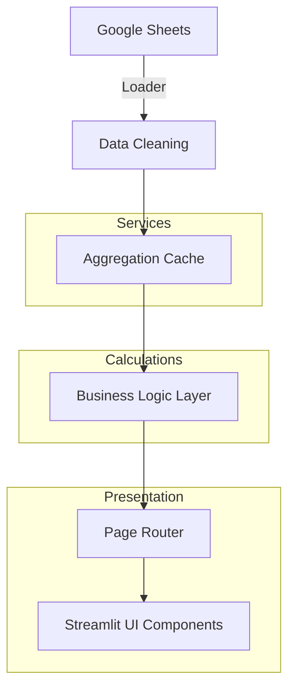

# WSMIS Dashboard v1.0.0-rc1

Workshop Management Information System for Multi-Location Dealerships

## Overview

A production-grade Streamlit dashboard that reads live data from Google Sheets, processes it in-memory with pandas, and renders interactive analytics with Plotly charts. Built for multi-location dealership groups to track workshop performance, advisor scorecards, location health, and generate management reports.

## Features

### Core Analytics
- **Overview Tab**: KPI cards with YoY comparisons, WS/BS split, monthly trends, location rankings
- **Labour YoY**: Location × month matrix with YoY badges, grouped bar charts, trend lines
- **Parts YoY**: Similar YoY analysis for parts revenue
- **Margin**: Margin waterfall chart, category × month matrix, trend analysis
- **Discounts**: Advisor discount tracking, heatmap, leakage analysis
- **Sales Mix**: Oil, tyre, battery, accessory sales with margin% analysis

### Advanced Features
- **Advisor Scorecard**: 1-5 star scoring system across 6 metrics (JC volume, labour/JC, parts/JC, oil/JC, accessory/JC, discount%)
- **Location Health**: Apple-style card grid with health indicators (🟢/🟡/🔴), clickable cards
- **Trends & Forecast**: 3-month linear regression forecasting for JCs, Labour, Margin
- **Reports**: 4 report generators (MIS Summary, Advisor Performance, Discount Leakage, AI Narrative)
- **Alert System**: Auto-detects high discounts, YoY declines, VOR charges, new locations

## Architecture



## Folder Structure

```text
wsmis/
├── app.py                  # Main Streamlit entrypoint
├── internal_audit_app.py   # Required legacy module dynamically loaded by app.py for Internal Audit Reports
├── requirements.txt        # Production dependencies
├── requirements-dev.txt    # Development/Test dependencies
├── .env.example            # Environment variables template
├── config/                 # Application configuration & environment
├── docs/                   # Documentation
├── pages/                  # Streamlit dashboard pages
├── services/               # Shared services (caching, error handling)
├── ui/                     # Reusable Streamlit UI components
├── utils/                  # Core logic, loaders, aggregations, filters
│   └── calculations/       # Financial math modules
└── tests/                  # Integration and unit tests
```

## Installation & Deployment

See the comprehensive guides in the `docs/` or root directory:
- [INSTALL.md](INSTALL.md) - For local development setup
- [DEPLOYMENT.md](DEPLOYMENT.md) - For production hosting guides

## Running Locally

1. Set up your environment and dependencies (see `INSTALL.md`)
2. Set your environment variable:
   ```bash
   export WSMIS_ENV=development
   ```
3. Run the app:
   ```bash
   streamlit run app.py
   ```

## Running Tests

WSMIS includes a comprehensive pytest suite to prevent regressions.

```bash
pip install -r requirements-dev.txt
python -m pytest tests/ -v
```

## Screenshots

*(Screenshots placeholder - to be updated post-deployment)*
- `Dashboard Overview`
- `Advisor Scorecard`
- `Location Health Grid`

## Version

Current version: **v1.0.0-rc1**

See [CHANGELOG.md](CHANGELOG.md) for version history.

## License

Internal use - Rukmani Motors (See [LICENSE](LICENSE))
